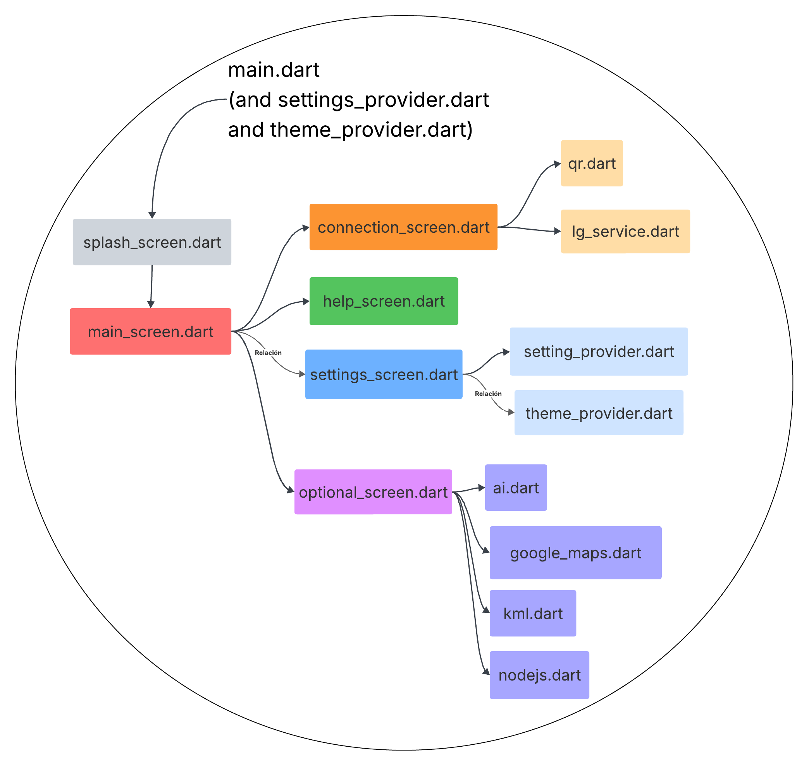

<div><center>
  
</center></div>


# Liquid Galaxy Master Web and Flutter Application 


## INDEX

1. [Introduction. What is this guide, and how does it work?](#id1)
2. [Onboarding](#id2)  
   2.1. [Getting started and bonding period](#id21)  
   2.2. [Prepare your environment setup](#id22)
   2.3. [Prepare your environment setup (macOS)](#id23)  
   2.4. [GitHub methodology](#id24) 
   2.5. [Deliverables and documentation](#id25) 
3. [Project types and technologies](#id3) 
4. [Liquid Galaxy](#id4)  
   4.1. [What is Liquid Galaxy?](#id41)  
   4.2. [Essential Liquid Galaxy functions](#id42) 
   4.3. [Data transmission to the Liquid Galaxy and KML management](#id43)  
5. [Flutter](#id5)  
   5.1. [What is Flutter?](#id51)  
   5.2. [How does Flutter work?](#id52) 
6. [Technical requirements and best practices](#id6)  
   6.1. [Rig testing and compatibility](#id61)  
   6.2. [Code quality and AI usage policy](#id62) 
   6.3. [Accessibility features and user experience/interface (UX/UI)](#id63) 
   6.4. [API key policy and Google services](#id64) 
7. [Responsibility and professionalism](#id7)  
   7.1. [Meeting schedule and attendance](#id71)  
   7.2. [Discord and email communication](#id72) 
   7.3. [Weekly Vlogs](#id73) 
   7.4. [Open source](#id74)
8. [Common mistakes and how to avoid them](#id8)
9. [Start your project](#id9)   
   9.1. [Minimum app features / screens](#id91) 
   9.2. [Code structure](#id92) 
10. [Your whole project step by step](#id10)
   10.1. [.dart_tool/](#id101)
   10.2. [.git/](#id102)
   10.3. [.idea/](#id103)
   10.4. [android/](#id104)
   10.5. [assets/](#id105)
   10.6. [build/](#id106)
   10.7. [images/](#id107)
   10.8. [ios/, linux/, macos/, web/, windows/](#id108)
   10.9. [lib/](#id107)
   10.10. [node_server/](#id1010)
   10.11. [test/](#id1011)
   10.12. [.flutter-plugins-dependencies](#id1012)
   10.13. [.env](#id1013)
   10.14. [.gitignore](#id1014)
   10.15. [.metadata](#id1015)
   10.16. [analysis_options.yaml](#id1016)
   10.17. [lg_master_web_app.iml](#id1017)
   10.18. [pubspec.lock](#id1018)
   10.19. [pubspec.yaml](#id1019)
   10.20. [README.md](#id1020)
11. [Further resources and documentation](#id11)
12. [Projects used to create this project](#id12)  

---

<h2 id="id1"> 1. Introduction. What is this guide, and how does it work? </h2>

Welcome to Google Summer of Code (GSoC) and to the Liquid Galaxy project! First and foremost, congratulations on being selected, as you are about to start a journey full of learning and professional growth. Starting a new project like this can feel intimidating or even overwhelming, especially if you’re unfamiliar with technologies like Liquid Galaxy, Flutter, or GitHub. However, you are not alone! This comprehensive guide has been carefully crafted to support you through every step of your GSoC experience, whether you are a complete beginner or already have some experience.

The purpose of this document is to serve as an all-in-one resource for anyone beginning their GSoC project with Liquid Galaxy. It complements a code repository that contains essential files and demonstrates how to build a basic Liquid Galaxy application, including its core screens and functionalities. Each line of code in this repository is commented with detailed explanations about what that line does and how it contributes to the overall structure of the file, making it easy to understand and follow. In this guide, everything is explained from scratch with examples, practical advice, and even links for further exploration. You will find key concepts explained step-by-step (from the technologies you will be using to how to structure your project), as well as overviews of project structure and organization, common mistakes and how to avoid them, and additional resources like documentation or previous projects in case you want to dig deeper. 

You are encouraged to use this guide as both a walkthrough and a reference manual, using it as a tutorial you can follow from the beginning or just jumping to specific sections whenever you need help. Also, as it was just said, alongside this guide you will have access to a project repository designed as a starting point. It shows how to organize your folders and files, where to place different functionalities, how to handle the configuration and connection to the Liquid Galaxy system, etc. Feel free to copy this code and adapt it for your project! That’s exactly what it was made for, so you already have somewhere to start.

GSoC is a challenge and can feel like a lot sometimes, but it is also a great opportunity! It is important to remember that mistakes are a natural part of learning, so don’t hesitate to reach out to your mentor for guidance. Above all, keep in mind that every small step forward counts. Each line of code, every solved bug, every problem solved, and every new concept learnt brings you closer to successfully completing your project. This guide is here to make sure you have all the tools and knowledge necessary to make your GSoC experience as easy and rewarding as possible. Welcome once again, and happy coding! :) 


<h2 id="id2"> 2. Onboarding </h2>

Working on your GSoC project is both an exciting and rewarding experience, but it can also feel overwhelming, especially if you don’t really know where or how to start. In order to make this process smoother, the Liquid Galaxy team offers a clear and structured onboarding process designed to help you integrate easily into both the development environment and the broader GSoC framework. This section outlines the most important steps to help you start strong and establish good habits that will support your progress throughout the entire program. It also assumes that you have already been selected for GSoC and completed the prerequisite tasks. As you will see during the development of your project, these prerequisite tasks are really important and will help you face many of the issues you may encounter during development, so make sure you put real effort on completing them.

<h3 id="id21"> 2.1. Getting started and bonding period </h3>

The bonding period is a crucial phase for laying the foundation of your project and building a strong working relationship with your mentor (or mentors). This period takes place before the official coding phase begins (for exact dates, please refer to the [Liquid Galaxy website](https://www.liquidgalaxy.eu/)) and serves as an opportunity to clarify expectations, ask questions, and plan your project in detail. Its main purpose is to get to know your mentor, clear up any uncertainties, and overall make sure everyone is aligned before development begins.

Once GSoC officially starts, you will receive an email to schedule your first project meeting, which will involve your main mentor, listening mentors and potentially other team members. It is mandatory to attend this meeting LIVE, as it is essential for setting clear goals and making sure your project starts on the right track. While other collaborators (such as listening mentors) may attend to observe and/or take notes, only assigned mentors and contributors are expected to actively speak and participate.

During this initial meeting, you will present and refine your initial project proposal, define specific objectives and deliverables and confirm the technologies and tools you will be using. For this, you will also break down the project into clear milestones and assign realistic deadlines. This meeting sets the groundwork for your GSoC experience, and listening mentors will often take notes to document all key decisions and discussions for future reference. It is also essential to establish a regular meeting schedule with your main mentor (ideally meeting at least once a week) and, when doing so, make sure to use a clear and consistent naming convention, like for example GSoC_contributor_mainMentor_projectName. This helps avoid confusion in the shared team’s calendar and makes sure meetings are easy to identify, as mentors may be in charge of more than one contributor.

Remember, mentors are there to guide you and support you, not to write your code. Respect their time and take meetings seriously by being punctual, prepared, and proactive. Be ready to share the progress you have made since the last meeting, as well as any issues or questions you may have. Goals should be set collaboratively, and it is your responsibility to meet the deadlines you agree upon, as establishing a consistent workflow and transparent communication from the very beginning will set the tone for a successful and productive GSoC experience.

<h3 id="id22"> 2.2. Prepare your environment setup </h3>

Before you can begin coding, you will need to set up your development environment. This setup is critical not only for testing your code locally, but also to make sure that your application is fully compatible with the official Liquid Galaxy infrastructure used at the Liquid Galaxy headquarters in Lleida (Spain). All contributors are required to create and work with a personal Liquid Galaxy virtual rig, which simulates the behaviour of the real system and allows testing and validating your application in a local environment. Please note that, in order to successfully pass GSoC, the final version of your application must work on the real Liquid Galaxy rigs at Lleida. This is a non-negotiable requirement.

For most contributors, the local development setup involves using VirtualBox to run a local instance of a Liquid Galaxy rig. This virtual rig provides a safe and controlled environment for building, testing, and debugging your application without depending on remote systems. In order to avoid compatibility issues and ensure your virtual rig works the same as the real ones at the headquarters, you should carefully follow these guidelines for the VirtualBox installation:
- **Use a vanilla LG configuration.** This means installing Ubuntu 16.04 with no system updates and no additional software beyond what is strictly required.
- **Do not request additional tools or packages** to be installed on the Liquid Galaxy rigs at the headquarters, as this may cause compatibility issues or even break existing systems.
- Make sure your app runs smoothly on both virtual and real rigs **without manual intervention or additional setup**.
Taking the time to set up your environment correctly will save you countless hours of trouble later, so be patient and take the time to do it right. If you need help during this setup process, you can follow [this tutorial](https://youtu.be/wzv-CiN6VeA?si=lzARoxDQWIY81poc) that walks you through the entire installation and configuration. Once your virtual Liquid Galaxy rig is ready, you can set up your application development environment and workspace. Here’s a quick checklist of everything you need to do:
- **Install Flutter.** Flutter is the main framework used in most Liquid Galaxy GSoC projects, as it allows building cross-platform apps efficiently, and it integrates well with both Android devices and the Liquid Galaxy system. You can download and install Flutter from the official website, following [this link](https://docs.flutter.dev/get-started/install).
- **Choose your IDE.** You will need an Integrated Development Environment (IDE) in order to build your app efficiently, like for example Android Studio or VSCode. Make sure you have Dart and Flutter plugins on the IDE you choose (Dart is the programming language used to develop Flutter apps).
- **Set up an Android Emulator (or use a physical device).** Although your project must be compatible with Liquid Galaxy, it also needs to work properly on Android devices. For this, you have two options:
   - ***Use a physical Android phone.*** You can either connect it to your development environment via USB or build an APK and install it manually.
   - ***Set up an emulator using Android Studio.*** For this, you will need to install the Android Emulator component on Android Studio and create a virtual device. In the GSoC context, it should be an Android phone. You can follow this [tutorial](https://youtu.be/GhuiNcOEv1A?si=Bt0Rr6vETa27Iszw) in order to create the virtual device.
- **Create a first version of your project.** You can either do it from scratch or clone the code repository (lg_master_web_app) that goes along with this documentation, which provides a basic and functional Flutter app that connects to Liquid Galaxy.
- **Use GitHub from day one.** All Liquid Galaxy GSoC projects are tracked via GitHub, so make sure you commit your progress regularly and from the start! If you have never used GitHub, don’t worry, that’s what one of the next sections is about. 

<h3 id="id23"> 2.3. Prepare your environment setup (macOS) </h3>

In the GSoC context, having a macOS is not the best situation because some tools (like VirtualBox and Android emulators) can behave differently than on Windows and certain dependencies may require extra configuration. But don’t worry, not everything is lost! Before you can begin coding, you will need to set up your development environment. This setup is critical not only for testing your code locally, but also to make sure that your application is fully compatible with the official Liquid Galaxy infrastructure used at the Liquid Galaxy headquarters in Lleida (Spain). All contributors are required to create and work with a personal Liquid Galaxy virtual rig, which simulates the behaviour of the real system and allows testing and validating your application in a local environment. Please note that, **in order to successfully pass GSoC**, the final version of your application must work on the real Liquid Galaxy rigs at Lleida. **This is a non-negotiable requirement.**

For most contributors, the local development setup involves using VirtualBox to run a local instance of a Liquid Galaxy rig. This virtual rig provides a safe and controlled environment for building, testing, and debugging your application without depending on remote systems. In order to avoid compatibility issues and ensure your virtual rig works the same as the real ones at the headquarters, you should carefully follow these guidelines for the VirtualBox installation:

- **Use a vanilla LG configuration.** This means installing Ubuntu 16.04 with no system updates and no additional software beyond what is strictly required.
- **Do not request additional tools or packages** to be installed on the Liquid Galaxy rigs at the headquarters, as this may cause compatibility issues or even break existing systems.
- Make sure your app runs smoothly on both **virtual and real rigs without manual intervention or additional setup**.

Taking the time to set up your environment correctly will save you countless hours of trouble later, so be patient and take the time to do it right. Once your virtual Liquid Galaxy rig is ready, you can set up your application development environment and workspace. Here’s a quick checklist of everything you need to do:

- **Set up a Virtual Galaxy rig.** Start by downloading and install [**VirtualBox for macOS**](https://www.virtualbox.org/wiki/Downloads). During installation, macOS may ask you to **allow the VirtualBox kernel extension** in **System Preferences → Security & Privacy**, so make sure to allow it. You should also **enable 3D acceleration in VirtualBox** for smoother display of multiple screens. After that, you can install the vanilla LG configuration using [**this tutorial**](https://youtu.be/wzv-CiN6VeA?si=lzARoxDQWIY81poc) (just skip through the beginning, since it’s the VirtualBox installation on a Windows device).
- **Install Flutter.** Flutter is the main framework used in most Liquid Galaxy GSoC projects, as it allows building cross-platform apps efficiently, and it integrates well with both Android devices and the Liquid Galaxy system. You can download and install Flutter from the official website, following [**this link**](https://docs.flutter.dev/get-started/install). In the case of macOS, you should extract it to a preferred folder (for example, `~/flutter`) and add Flutter to your `PATH` by adding `export PATH="$PATH:$HOME/flutter/bin"` to your shell configuration file. Finally, run `flutter doctor` in the terminal to check for any missing dependencies.
- **Choose your IDE.** You will need an Integrated Development Environment (IDE) in order to build your app efficiently, like for example Android Studio or VSCode. Make sure you have Dart and Flutter plugins on the IDE you choose (Dart is the programming language used to develop Flutter apps). Both VSCode and Android Studio are compatible with macOS.
- **Set up an Android Emulator (or use a physical device).** Although your project must be compatible with Liquid Galaxy, it also needs to work properly on Android devices. For this, you have two options:
   - ***Use a physical Android phone.*** You can either connect it to your development environment via USB or build an APK and install it manually.
   - ***Set up an emulator using Android Studio.*** For this, you will need to install the Android Emulator component on Android Studio and create a virtual device. In the GSoC context, it should be an Android phone. You can follow this [tutorial](https://youtu.be/GhuiNcOEv1A?si=Bt0Rr6vETa27Iszw) in order to create the virtual device.
- **Create a first version of your project.** You can either do it from scratch or clone the code repository (lg_master_web_app) that goes along with this documentation, which provides a basic and functional Flutter app that connects to Liquid Galaxy.
- **Use GitHub from day one.** All Liquid Galaxy GSoC projects are tracked via GitHub, so make sure you commit your progress regularly and from the start! If you have never used GitHub, don’t worry, that’s what one of the next sections is about. 

<h3 id="id24"> 2.4. GitHub methodology </h3>

All contributors will work within the official Liquid Galaxy GitHub, where your project’s repository will be hosted. This centralized approach ensures consistency across all projects, facilitates collaboration and allows mentors to track your progress. Once your personal repository is created, you will be granted access, and from there your day-to-day workflow will begin. Keep in mind that **all project repositories are private until the end of GSoC**. They will only be made public at the end of the program, once the final version of your application is ready and approved.

There are multiple ways to upload your code to GitHub. You can **use the GitHub web interface** (which is useful for simpler updates, like small edits or uploading files manually) or **use Git from your cmd** (which is the recommended option for regular development work, as it gives you full control over versioning, branches, and collaboration). To start working with Git and make sure you are able to upload your changes correctly, you must follow these steps:
- **Open your cmd.**
- **Navigate to the directory where you want to store your project locally.** If you have never done this, the command here is `cd your_project_path`. This directory is where your GitHub repository will be cloned, and you can choose any location (your Desktop, a specific folder, etc.). As an example, I created a folder called “FlutterProjects”, navigated into it, and cloned my repository there. As a result, a new folder called “LG-Master-Web-App” (the name of my GitHub repository) was created inside the “FlutterProjects” folder.
- **Clone your GitHub repository into this place.** The command here is `git clone your_github_repository_url`. To easily copy this URL (which should have the structure https://github.com/your_github_repository_link.git), you can find it clicking on the green “Code” button on the web interface and copying the link under “HTTPS”.
- **A new folder with the repository’s name will be created automatically.** This is the folder where you must work from now on.
- **Navigate to the repository folder using cd on the cmd again.**
- **Initialize an empty git repository.** The command here is `git init`.
- **Add the origin route to your GitHub project repository.** The command here is `git remote add origin https://github.com/your_github_repository_link.git`.

Once this setup is complete, you are ready to start working and uploading your progress to GitHub using Git. Each week, you are required to raise a Pull Request (PR) to show your progress, which will be merged at the end of the week. A Pull Request is a GitHub feature that allows you to propose changes from one branch (usually a feature branch, which is a branch different to the main one) into another (typically the `main` branch). This process allows mentors to review your code before it is merged into the main codebase. 

Your weekly PRs serve multiple purposes, as they act as a historical record of your work, they allow mentors to review progress, and they form the basis of your GSoC evaluations. It is really **IMPORTANT** to remember that you are expected to **raise and merge your own PRs** each week (unless a different process is discussed and approved with your mentor). Also, it is better to **avoid pushing code directly to the `main` branch**. Instead, create feature branches for different parts of your project (for example, main-screen-features, connection-features, etc.) and merge them into main via PRs to keep your project history clean and organized. If you want to **create a new branch** (a branch being basically a separate line of development that allows you to experiment or work on features without affecting the main project), the command here (make sure you are inside your repository folder) would be `git checkout -b feature-name`, with “feature-name” being the name you want to give your branch.

Every time you want to make changes locally and want to upload them to GitHub, you have to follow this process:
- **Open the cmd.**
- **Navigate to your folder project.** The command here is `cd your_project_path`.
- **Make sure you are on the correct branch of your project.** The command to get a list with all the branches is `git branch`. In order to understand this part, let's assume your main branch is called `main` (this is the default name, normally because it helps to understand the project easily, but you can also choose a different one) and that you have two feature branches called “other-branch1” and “other-branch2”. The output of this command will be a list that looks like this:
   - *main
   - other_branch1
   - other_branch2
   
  "*" indicates the branch you are in right now. In case you were not in the main branch, you would need to use the command `git checkout main`.
- **Add the new or modified files.** The command here is `git add .`.
- **Add a comment about the update.** The command here is `git commit -m "whatever you want to say"`. This is not mandatory, but adding comments explaining what you added in each update is INCREDIBLY useful and helps keep track of your work. A **commit**  is a saved snapshot of your project at a specific point in time, and records the changes you made to the files locally (**a commit is saved locally and then saved in the cloud by pushing it**).
- **Add the content and the comments to your branch (push your changes into your branch).** The command here is `git push origin your-branch-name`. For example, let’s say you are on the branch called “other-branch-1”. The command here would be `git push origin other-branch-1`. 

It is better to update changes into separate feature branches rather than directly in the main branch. This is because branches act as safe, isolated workspaces where you can experiment, organize your work, and ensure quality before integrating changes into your main project. This approach also prevents accidental disruptions to the main codebase. To open and merge a Pull Request, you will have to go to the GitHub web interface and do the following:
- If you have recently pushed a new branch, GitHub will usually suggest opening a PR automatically. You should click on **“Compare and pull request”**.
- Alternatively, you can go to the **“Pull requests”** tab and click **“New pull request”**. 
- In the PR form, you will have to select the **source branch** (your feature branch) and the **target branch** (usually `main`). 
- **You can also write a brief title and description summarizing your changes.** As with the work updates, this is optional, but very useful to keep track of what you have done. 
- Finally, click **“Create pull request”**. 

Once your Pull Request is open, any additional commits pushed to the same feature branch will automatically be included in the Pull Request. At the end of the week (unless told otherwise), you are expected to merge the PR yourself by opening the PR on GitHub, scrolling down, clicking **“Merge pull request”** and then confirm by clicking **“Confirm merge”**.


<h3 id="id25"> 2.5. Deliverables and documentation </h3>

In addition to writing code, you are also expected to maintain **clear, detailed and well-organized documentation** throughout the entire duration of your GSoC project. Documentation is just as important as the code itself, as it makes sure that others (including mentors, users of your application, or even your future self) can understand, use, and build upon your work. Good documentation significantly improves the long-term value and usability of your contribution.

To help you manage and store all deliverables, you will receive a **shared Google Drive folder** dedicated specifically to your GSoC project. This folder should be updated regularly and kept properly organized, as it will serve as the central location for all final project materials. It will be reviewed during evaluations and may also be shared with future contributors, so take it as seriously as writing code. Your shared folder should include the following components:
- **APK builds.** Create a subfolder for each APK version you generate during the project. These subfolders should be clearly named using version numbers and their corresponding build dates according to the following structure: `appname_X.Xv_contributorName_GSoCyear`. For example, lgMasterWebApp_v1.0_luciaFernandez_GSoC2025, lgMasterWebApp_v2.1_luciaFernandez_GSoC2025, etc.). **Never delete or overwrite older versions**, as keeping a full history of APK versions allows mentors to track your progress over time and provides the option to roll back if needed. A rollback refers to the ability to revert your application back to an earlier version in case the new one introduces bugs, performance issues, or other problems.
- **Project documentation.** This is one of the most important components of your final submission. You must maintain a document that includes setup instructions for running your application (both on Liquid Galaxy and on Android), code explanations, a usage guide (explaining how users would interact with the application), and architecture decisions (why you built things the way you did). It is also important to paste relevant code snippets into the document and explain their purpose and behaviour, and diagrams and screenshots can also be helpful to visually support your explanation. This document should be started at the beginning of your project and updated continuously as your code evolves, since waiting until the last minute will make it much harder to recall decisions or provide accurate context. This project documentation should be a **README.md** that will be included in the GitHub repository.
- **Worklog.** You will be required to log your weekly progress in an Excel file. To begin, you will copy a pre-made template and rename the file with the following format: `Surname_Name_GSOCyear_Worklog`. In this document, you will have to record the daily and weekly work you have completed, any blockers or bugs with their possible solution, and your planned work for the upcoming week. This worklog will be extremely useful during your evaluations, as it provides a clear and consistent record of your progress, learning, and problem-solving approach.
- **Other assets.** Basically any additional files that are part of your project or relevant for your final submission. These might include logos, media files, etc.

Finally, you will also receive instructions and a deadline to submit your project to the [**GO webstore**](https://store.liquidgalaxy.eu/). Please, make sure to meet this deadline, as missing it could significantly reduce your chances of passing GSoC.

<h2 id="id3"> 3. Project types and technologies </h2>

Liquid Galaxy GSoC projects involve a diverse and evolving set of technologies, all centred around building innovative, real-world applications that interact with the Liquid Galaxy rig, a multiscreen panoramic visualization system used for presenting geographic, scientific, and educational data in a dynamic, immersive environment (more information on the Liquid Galaxy in the next section). Depending on the focus of your project, you may be working on mobile applications, robotics integrations, AI-enhanced applications, or other creative implementations. Each project type comes with specific technical requirements and development workflows, and understanding these early in the process will help you ensure a smooth and productive development experience.

For GSoC, students can either apply to work on a **pre-defined idea from an accepted organization** (you can check the list of the GSoC 2025 organizations here, but the list is updated each year) or **propose their own original project** that fits within the scope of that organization. **Liquid Galaxy also publishes a list of suggested project ideas each year**, but **students are encouraged to think creatively and submit their own ideas**, especially if they align with Liquid Galaxy’s mission of open data, geospatial visualization, education, and real-world impact. So, if you have a unique and innovative project idea, you are more than encouraged to submit a proposal! Demonstrating creativity, technical clarity and preparation in this proposal will make a strong impression on mentors and improve your chances of being selected.

Most Liquid Galaxy GSoC projects involve developing **mobile applications using Flutter**, an open-source framework developed by Google that enables fast and cross-platform app development with a strong emphasis on UI and performance (more on Flutter in a later section). These applications must be **compatible with Android phones**, and your apps will be installed and tested on these devices, so you should design your app with this screen configuration in mind. These apps can serve a wide variety of purposes: data visualization tools, interactive maps, educational games, control panels, and more. Be creative! You have the flexibility to explore novel ideas, as long as they align with the core mission of the Liquid Galaxy project and are achievable within the GSoC timeframe.

Some projects go beyond mobile development and explore robotics integration with Liquid Galaxy. These applications often still use Flutter for the user interface, but are also closely tied with **physical or simulated robotic systems**. To manage complexity and ensure cross-platform compatibility, these projects use Docker, a tool that allows to package your application and its dependencies into a single container that can be easily deployed in any environment. You must provide a complete **Docker image** of your project, including a well-documented **Dockerfile** with instructions for building, running, and configuring your app. If your project relies on auxiliary services (for example, communication with Arduino boards, sensor data collection, microcontroller scripts, etc.), these must also be documented within your Docker setup. Docker not only simplifies deployment and testing, but also makes sure your application behaves consistently across different environments, whether on your local machine or in the robotics lab. Additionally, if your project requires robotic simulations, you can use tools like [**Gazebo**](https://gazebosim.org/home), [**Webots**](https://cyberbotics.com/), or [**ROS-based simulators**](https://docs.ros.org/en/foxy/Tutorials/Advanced/Simulators/Simulation-Main.html) to test and visualize robotic behaviours virtually. This is especially useful if you’re working remotely or have limited access to hardware.

Some Liquid Galaxy applications are developed as web-based tools (for example, remote dashboards, administrative interfaces, or content managers). These applications often act as **control points or data input interfaces** that interact with the Liquid Galaxy rig over a network. Depending on the scope of your application, you may use [**Node.js**](https://nodejs.org/es), [**Python Flask**](https://flask.palletsprojects.com/en/stable/) or [**React**](https://react.dev/). You will receive specific deployment guidelines from your mentor regarding how to host and configure your web app within the Liquid Galaxy headquarters in Lleida. Make sure your web app is optimized for performance, tested in real scenarios, and securely integrated with the rest of the system. While your mentor will support you in setting up hosting environments, you are expected to follow best practices in terms of web development, including **responsive design and proper data handling**.

More advanced Liquid Galaxy projects may include **Artificial Intelligence components** to improve user interaction or automate data processing. These applications are typically built with Flutter as the frontend and integrate AI services like Google’s Gemini AI, which supports advanced text, image, or data analysis. You must also implement a settings section within the app where users can enter their own API key to connect to the Gemini service, and all the requests to AI services must be handled securely and transparently. **If you plan to use any third-party APIs or AI services other than Gemini** (for example, OpenAI), **you MUST first request approval from the Liquid Galaxy admin team before integrating them into your project**. These projects offer possibilities such as smart assistants, natural language interfaces, or intelligent recommendation systems, but they also require careful consideration of API limits, latency, and user privacy.

Liquid Galaxy projects may involve a variety of programming languages and tools, depending on the type and scope of your project. You can find information on the most commonly used technologies [**on this link**](https://www.liquidgalaxy.eu/2024/05/tech-stack-and-use-cases.html#content-wrapper), but here is a small summary:
- **Linux.** Used for Ubuntu-based systems, rig-level configurations, and sending commands to the Liquid Galaxy rig. Due to its performance and reliability under high network demands, Linux (usually Ubuntu LTS) is the chosen open-source operating system for Liquid Galaxy environments.
- **Python.** Used for backend scripts, data analysis, or automation. Currently one of the most popular and versatile scripting languages.
- **Node.js.** Used for building web servers and enabling real-time communication between multiple Chromium browsers (the open-source version of Google Chrome) running on the Liquid Galaxy system.
- **Flutter / Dart.** Used for cross-platform mobile app development. This SDK (Software Development Kit) enables high-performance and high-fidelity apps for iOS and Android from a single codebase. More on Flutter and Dart in a later section.
- **Android SDK.** Used for mobile integration and testing. It is the standard toolkit for interacting with devices compatible with Android and Chrome OS.
- **TensorFlow.** An open-source software library developed by Google. Used for tasks like analysing and processing data to be displayed on the Liquid Galaxy rig. 
- **Large Language Models (LLMs).** Used to process GIS (Geographic Information System) data in order to create visualizations and tours on the Liquid Galaxy rig. LLMs enable computers to understand and generate text similar to how humans communicate.
- **Docker.** Used for isolated deployment, especially in robotics projects. Essential for containerizing applications.

You are encouraged to **experiment and explore new tools and technologies**, as long as they are stable, well-supported, and align with your project’s goals. If you are ever unsure about whether a particular tool or framework is a good option, consult your mentor to make sure it fits within the GSoC timeline and expectations.

<h2 id="id4"> 4. Liquid Galaxy </h2>

<h3 id="id41"> 4.1. What is Liquid Galaxy? </h3>

Liquid Galaxy is an open-source project founded by Google that allows users to navigate Google Earth, view videos and photos, create interactive tours, and visually display GIS data in an immersive and panoramic format. Created in 2008 by Google employee Jason Holt, Liquid Galaxy was originally conceived as a multiscreen viewer for Google Earth. Since then, it has evolved into a powerful and versatile tool used for much more than just exploring geographic data, as it is now also used for data visualization, virtual tours, and more. 

A typical Liquid Galaxy rig consists of multiple high-resolution screens connected and arranged to create a seamless panoramic environment. This immersive setup surrounds the viewer, providing a wide-angle, unified display that enhances the visual experience. **In the case of the Lleida labs, the Liquid Galaxy rig consists of 5 screens**, but this number can vary depending on the specific installation (some setups use just three, while others use five or more depending on the available space, hardware, and project needs). This flexibility makes the system highly adaptable to be used in both small labs and large exhibitions.

If this is your first time hearing about Liquid Galaxy, imagine yourself walking into a room surrounded by several large monitors, each displaying a segment of a single, synchronized scene, whether it’s a dynamic Google Earth view, a real-time video stream, or an interactive 3D map. The collective display stretches across the user’s entire field of vision, immersing them in the content and allowing real-time interaction using traditional controls like a keyboard and mouse, or more advanced features like voice commands, touch interfaces, or external sensors.

The technical foundation of Liquid Galaxy is built on a master-slave architecture, which ensures smooth coordination and synchronization between screens. **Each screen is powered by its own dedicated computer, and the system typically requires one computer per display, all connected over a local network**. One of these computers is designated as the **master node** (responsible for controlling the content and camera movements across all screens and the navigation commands), while the others act as **slave nodes** (which simply follow the instructions they receive from the master and mirror the master actions to make sure all displays remain perfectly synchronized). This **distributed architecture** offers both high performance and easy scalability, as new screens can be added to the setup simply by introducing new slave nodes and updating the system configuration, without needing to redesign the entire rig. Here's how it works:
- **Master/slave architecture.** When a user interacts with the master screen (for example, by zooming in, rotating the view, or navigating across Google Earth), the master computer sends real-time commands to all slave computers. These commands instruct each slave display to adjust their views accordingly, creating a seamless panoramic effect, which ensures that all screens act as a unified, coordinated display.
- **Independent rendering.** Each screen runs its own independent instance of the visual software (traditionally Google Earth, though today this can include custom visualizations or interactive applications). Despite rendering different portions of the scene, all screens remain perfectly in sync thanks to the master node’s continuous updates.
- **UDP network communication.** The coordination process between master and slave nodes is managed using UDP (User Datagram Protocol), a fast and simple communication protocol is known for its low latency and minimal overhead, making it ideal for real-time environments like Liquid Galaxy. UDP is used to transmit information such as camera angles, zoom levels, and scene transitions across the network.

Although Google Earth is frequently used as the central visual engine, it’s important to note that **Liquid Galaxy itself is a separate open-source project**. This distinction is important because it means **developers are not limited to Google Earth**, and they can freely design and deploy a wide variety of open-source applications, including tools that visualize custom GIS data, live dashboards, sensor outputs, robotic controls, and more. As a fun fact, Google Earth itself is not open-source software, but it is free to use and can be integrated into Liquid Galaxy setups through approved APIs and methods. Today, Liquid Galaxy is used by a wide range of companies, nonprofit organizations, and universities to present information in a more engaging and interactive way. Google itself continues to use Liquid Galaxy for trade shows and exhibits, using it as a platform to promote its own geospatial technologies.

One of the best aspects of Liquid Galaxy development is that **you don’t need a full rig to start building**. In fact, most developers (especially students participating in programs like GSoC) do their work on a single screen setup, using simulators or portable Liquid Galaxy kits, testing them later on larger installations. These alternatives replicate the rig’s functionality on a smaller scale, making development more accessible, affordable, and convenient, and allow developers to simulate the master-slave architecture virtually (or connect a few monitors to test multiscreen behaviour locally). Once your application is working properly in this scaled-down environment, it can be deployed and tested on a full rig for final validation. Whether you are developing an application that sends KML tours to the rig, controls robotics functions, manages real-time data feeds, or integrates with AI tools, your project’s success will depend on how well it integrates with the core architecture, multiscreen synchronization, and immersive capabilities of Liquid Galaxy.

<h3 id="id42"> 4.2. Essential Liquid Galaxy functions </h3>

When developing an application for Liquid Galaxy, there are several core features and behaviours that must be implemented to ensure proper functionality and user experience. These features are essential to how your application integrates with and supports the capabilities of the Liquid Galaxy system. The most important function is that your app connects with the Liquid Galaxy, and it is also important to keep in mind that your app may connect on the virtual rig but not on the real one. **If your app does not connect with the real and physical Liquid Galaxy rig, you will not pass GSoC**.

One of the most frequent issues in previous projects has been the lack of synchronization between the map displayed on the user’s mobile device and the Google Earth view on the Liquid Galaxy rig. **Your application must make sure that any interaction on the mobile device** (whenever a user navigates, searches for a location, or interacts with a map on their phone) **is reflected in real time on the Liquid Galaxy rig’s multiscreen setup**. This synchronization must create a unified and seamless experience across devices and **maintain consistent coordinates, camera angles and zoom levels**. It must also be **bidirectional** if necessary, which means that updates from the Liquid Galaxy rig (such as orbit animations or tour progress) should also be reflected on the mobile app interface.

Your application should also **implement a QR code scanning feature to quickly and easily connect to the Liquid Galaxy rig**. When the app is launched for the first time (or whenever reconfiguration is needed), the user should be able to scan a QR code generated by the Liquid Galaxy system or configuration tool. This QR code should contain key information such as IP address, port numbers or network credentials, enabling automatic connection setup. The goal of this process is to make the Liquid Galaxy configuration a simple, quick and error-free, even for users without advanced technical knowledge.

Your application should also be capable of **storing the previous configuration settings from the last session and using them to automatically reconnect when the app is launched again**, a behaviour that saves time and avoids redundant setup steps. Upon startup, the app should immediately attempt to connect to the Liquid Galaxy rig using the stored settings. If the connection is successful, a brief confirmation message (for example, a popup message or a notification) should be shown. The app should also display the Liquid Galaxy logo or relevant branding (logos of brands or technologies used during the project) during the startup (this will be displayed on a screen called “splash screen”, more on that on later sections). Additionally, **any previously sent KML files** (which include geographical data or overlays) **should be cleared or replaced**, making sure the system is clean and ready for a new session.

Liquid Galaxy is particularly effective at displaying immersive 3D views, especially when used with Google Earth. To take full advantage of this capability, your application must carefully control the camera settings. **You should avoid using a purely zenithal (top-down) view**, as it flattens the scene and diminishes depth perception. Instead, **set the camera to approximately 2 kilometres above the ground and use a tilt angle of at least 45 degrees**. It is important to combine appropriate pan and tilt settings to deliver a more engaging and realistic 3D visualization. This approach enhances how users perceive landscapes, buildings, and landmarks.

When **displaying KML content** (such as placemarks, tours, or data overlays), **your application must make sure that the camera viewpoint is zoomed in enough for the content to appear across the central three screens of the Liquid Galaxy rig**. It is important to **avoid camera positions that are too distant** (which results in content only appearing on the central screen) **or too wide** (which makes key information too small to interact with effectively). This is particularly critical for Points Of Interest (POIs), where central visibility and scale are key to immersion.

**Each POI displayed by your application should include an option to orbit around it** (to showcase the location from all angles), a feature that improves user engagement and allows for better spatial understanding. You must make sure that this orbiting tool includes **controls such as play, pause, or stop buttons**, as well as allows users to **choose the rotation speed or direction** (if possible). Orbiting is especially useful when showing architectural models, geographical landmarks, or custom 3D objects.

Finally, to make sure your application feels complete and user-friendly, **make sure to include a predefined list of content or interactions that the user can explore**. This list might include suggested search terms, featured locations, saved tours, or datasets relevant to the app’s purpose, and **the goal is to give users a starting point rather than requiring them to input everything manually**. This is particularly useful for demos, educational uses, and public exhibitions, where immediate content access is essential, and all contributors are expected to implement this feature as part of the project baseline.

<h3 id="id43"> 4.3. Data transmission to the Liquid Galaxy and KML management </h3>

When developing applications for the Liquid Galaxy platform, one of the essential components for visualizing data is the use of **KML (Keyhole Markup Language) files**, which is an XML-formatted file used to display geographic data in mapping applications. This format is strongly emphasized as the standard format for displaying geographic content such as Points Of Interest (POIs), tours, overlays, and interactive elements.

A key requirement (as it was mentioned in the previous section) is to **delete any previously loaded KML files each time the application is launched**. This practice ensures that the system starts with a clean visual slate, avoiding cluttered or outdated visualizations and preventing conflicts by overlapping data from past sessions. From a technical perspective, this involves sending a **command to the master node** of the Liquid Galaxy rig instructing it to remove all active KML layers. Once the reset is complete, the system is ready to receive and display new and updated KML content. To manage KMLs effectively, your application must be capable of generating clean, valid, and well-structured KML code, which includes properly formatted tags, maintaining consistent coordinate structures and implementing elements such as `<Placemarks>`, `<LookAt>`, `<Polygon>`, `<Style>` and `<ScreenOverlay>`. It is important to **validate all of your KML files**, as malformed or incomplete code can lead to rendering errors, missing data, or even system instability on older versions of Google Earth, which are commonly used on Liquid Galaxy rigs.

Another common challenge developers face is the use of **KML balloons**, which are the small information windows that appear when a user clicks on a placemark. These balloons can display a combination of text, HTML, images, or links, but **their behaviour on Liquid Galaxy systems is often inconsistent** due to the **limited rendering capabilities of legacy browser engines** within older Google Earth versions. Common issues include broken formatting, unsupported HTML/CSS styles, or misaligned content. Additionally, **KML balloons are not always ideal for non-interactive or large-format installations** (such as public exhibits or demo rigs) where user input is minimal or restricted. Due to these limitations, it is often recommended to either minimize reliance on KML balloons or keep their content simple, concise, and compatible with older rendering engines. Alternatively, some developers choose to build custom overlays or floating panels within the Liquid Galaxy environment to show additional information.

Finally, if your application involves **retrieving data from a custom database** (such as a local backend or cloud-based service), you will typically need to query and **process the data on the server or client side**, as well as convert the results into dynamically generated KML files. You will also need to transmit these resulting KMLs to the Liquid Galaxy master node using a reliable communication protocol, often via SSH, UDP commands, or tools like `lg-layers` or `lg-control` scripts. All of this process includes, of course, monitoring the system to confirm that files have been properly received and displayed.

<h2 id="id5"> 5. Flutter </h2>

<h3 id="id51"> 5.1. What is Flutter? </h3>

**Flutter** is an **open-source User Interface (UI) toolkit** developed by Google that **allows developers to reuse code across different operating systems** (such as iOS, Android, web, and desktop) while also allowing apps to interact directly with the native features of each platform. This means that, instead of creating separate apps for each operating system, developers can build high-performance apps for many platforms using mostly the same code.

One of Flutter’s key advantages is its fast development cycle. During development, Flutter apps run in a Virtual Machine (VM) that supports a feature called **Hot Reload**, which allows developers to see the UI changes almost instantly after saving code without the need for a full recompile (a process that significantly speeds up development and iteration times). Once the app is ready to be released, Flutter compiles the code directly into native machine code (for mobile) or to JavaScript (for web), resulting in fast runtime performance and a smooth user experience. Flutter also uses its own high-performance rendering engine, and its widgets are designed with built-in support for platform-specific behaviours like scrolling, navigation, fonts, and icons.

Flutter apps are written in an **object-oriented** programming language called **Dart**, which was also developed by Google. Dart is optimized for UI development and compiles efficiently to both native code and JavaScript. When an app is built, Flutter turns the Dart code into machine code to make sure it runs as efficiently as possible on the target platform. Flutter is structured in a layered architecture, with each layer being responsible for a specific part of the system. From the lowest to the highest level, we have:
- **Foundational layer.** Provides low-level and reusable building blocks and core services used throughout the rest of the system. These include features like painting, animations, or asynchronous operations.
- **Rendering layer.** Responsible for laying out and displaying widgets. It builds a tree of visual objects that can be manipulated dynamically and that automatically updates as the application’s state changes. This is called the render tree, and is a dynamic representation of the visual elements that Flutter displays on the screen.
- **Widgets layer.** It lets developers create the user interface using small building blocks called widgets, and this is also the layer where the reactive programming model is introduced. Each object from the rendering layer has a corresponding widget in this layer. Widgets can be combined and reused in order to build complex UIs.
- **Material and Cupertino libraries.** These libraries provide a set of pre–designed UI components that follow either Material Design’s (Google’s design system for Android) or Cupertino (Apple’s design system for iOS) guidelines, allowing apps to look and feel native on each platform.

Flutter uses a **reactive programming style**, which means that, instead of manually updating the interface every time something changes (as done in traditional frameworks), it is the framework that updates the interface at runtime when the application state changes. The developer describes how the UI should look based on the current app state, and Flutter automatically updates the interface when that state changes, similar to a smart assistant keeping the app in sync.

This approach reduces complexity, improves maintainability, and avoids many of the bugs caused by inconsistent UI states, similar to how modern frameworks like [**React**](https://react.dev/) or [**SwiftUI**](https://developer.apple.com/swiftui/) work. In contrast, most traditional UI frameworks describe the user interface once and then developers must manually update it later when things change. As apps get more complex, this can become hard to manage because changes in one part of the app can affect many others. **Flutter also supports a huge collection of plugins and packages** like camera access, location services, maps, payments, authentication, and much more, making it easier to integrate advanced features without building everything from scratch.


<h3 id="id52"> 5.2. How does Flutter work? </h3>

At the heart of Flutter development are several core concepts, these being **widgets**, **state** and **classes**. Widgets are the basic building blocks of any Flutter user interface, which means that, in Flutter, **everything you see on the screen** (texts, images, buttons, containers, layouts, rows, columns, etc.) **is a widget**, even the entire application screen! Flutter follows a **composition-based architecture**, which means that widgets can be composed or combined within one another to create more complex user interfaces. This approach promotes code reuse, clarity and scalability, as it becomes easier to build large applications from small and reusable pieces. There are two main types of widgets, `StatelessWidget` (which are immutable and represent parts of the UI that never change once built, like for example a static title or a logo) and `StatefulWidget` (which are mutable and can change dynamically based on user interaction or data updates, like for example a counter that updates every time a button is pressed). Stateful widgets maintain a state object that stores values over time and triggers UI updates when changes take place.

**State** refers to the current configuration or data of a widget at any given moment. In stateful widgets, the state is stored in a separate class that can be updated using the `setState()` method. When the state is updated, Flutter automatically triggers a **rebuild** of the widget tree, ensuring that the UI always reflects the current state of the application. This **reactive update mechanism** makes sure the user interface stays in sync with the application’s logic.

In Dart, everything is organized into **classes**, including widgets, and a class defines the structure and behaviour of a component. When you create a custom widget in Flutter, you define it as a class that extends either `StatelessWidget` or `StatefulWidget` and you override specific methods like `build()`, which is the function that tells Flutter what the UI should look like for that particular widget. To `override` a method in Dart means to **provide a new implementation of a method that was originally defined in a parent class**. In this example, overriding the `build()` method would allow you to define the widget’s layout and design. The base class (like for example `StatelessWidget`) provides a default implementation of `build()`, but by overriding it in your custom class you provide a custom UI definition that fits your specific component. Understanding how to define and use classes is fundamental in Flutter, as they define the app’s structure and logic.

During development, it’s important to be able to see the results of your code changes quickly. Flutter supports **Hot Reload**, which (as mentioned in the previous section) allows near-instant updates to the app’s UI as soon as you save your changes, all without requiring a full app restart. This significantly improves developer productivity and shortens the feedback loop during UI design and debugging. However, **for some changes** (especially those involving **dependencies**, **project setup** or **state initialization**) you may need to **fully rebuild the app**. This can be done using the following commands:
- `flutter clean`. Clears the build cache and removes previously compiled files. This is done to avoid build issues or to ensure a fresh compilation.
- `flutter pub get`. Installs and fetches all project dependencies listed in the pubspec.yaml file. This is required after adding, removing or updating packages.
- `flutter run`. Compiles and launches the app on a connected device or emulator. You can also use Android Studio’s built-in emulator to run your app interactively.

These commands ensure that your app is properly built and that any changes you make are reflected either in real time or through a full recompilation. Once development is complete and your app is ready for distribution, you can create an installable APK suitable for release using the following command: 

`flutter build apk --release`

This command compiles the Dart code into optimized **native machine code** and packages it into an `.apk` file that can be installed on Android devices. After running this command, you will find the generated APK in the following directory:

**build → app → outputs → apk → release**

Inside this folder you will find a **subfolder** named **baselineProfiles**, a **JSON file** named `output-metadata.json` and the `app-release.apk` file, which is your **installable APK**. You can also find the APK in:

**build → app → outputs → flutter-apk**

The difference between these two locations is that the first one **(apk/release)** contains the official release output and metadata required by the Google Play Store, while the second one **(flutter-apk)** is typically where Flutter stores fast builds or platform-specific APK outputs that may vary depending on the build configuration. Once you have an `.apk` file, you can install it manually on your device, distribute it, or upload it to the Google Play Store following Android’s publishing guidelines. In the context of GSoC, you can find all project APKs in the [**GO webstore**](https://www.liquidgalaxy.eu/2018/12/go-web-store.html#lg-web).

<h2 id="id6"> 6. Technical requirements and best practices </h2>

Following strict technical standards and best practices is essential for developing high-quality and functional solutions during GSoC, as **your work must meet the expectations of both the Liquid Galaxy community and the Google Summer of Code program**. These requirements make sure that your code is functional, scalable and easy to debug while also promoting good UI, accessibility, and long-term sustainability. The following sections outline the key technical guidelines you must follow to ensure your work is both efficient and aligned with the goals of the program.

<h3 id="id61"> 6.1. Rig testing and compatibility </h3>

**Making sure that your application is fully functional and compatible with the Liquid Galaxy rig is one of the most critical technical requirements of the GSoC project**. From the earliest stages of development, your app should be designed with rig compatibility, stability, and integration in mind, since it will eventually be **deployed and tested on real Liquid Galaxy hardware**. Your application must be **ready and stable enough for the Midterm Evaluation**, which typically takes place around mid-July (although the exact date may vary each year). It is highly recommended that you have your application **ready even earlier**, as this allows you to have more time for internal testing, debugging, and refinement, increasing your chances of passing the evaluation successfully.

Following the midterm, you will receive detailed **feedback** (often in the form of recorded test sessions or video walkthroughs) where mentors will highlight bugs, critical functionality issues, performance problems, or missing or incomplete deliverables. **It is your SOLE responsibility to carefully review this feedback, understand the issues that were raised, and make the necessary improvements**, addressing and resolving all issues identified in these recordings. **No additional tests will be scheduled until you explicitly confirm that all identified issues have been resolved** and that your app is ready for re-evaluation.

The **final round of testing** usually takes place **in the second week of August** (again, the exact date may vary each year), and it is the date when your application will be **tested using the actual Liquid Galaxy rigs** located at the Lleida labs. These systems are configured to reflect production-level conditions, meaning your app will be tested as if it were ready for public deployment. By this point, your application must be **fully functional and stable**, with no critical bugs, crashes, or untested features. It should be **completely compatible with the Liquid Galaxy environment**, including proper multiscreen behaviour and interactivity. In addition, it must be **well-documented**, with clean, readable source code and accompanying documentation for users, mentors, and future developers. The app should be **simple and intuitive to operate**, requiring **minimal setup for demonstration or testing**, and it must be **properly packaged**, ready for deployment or installation on the Liquid Galaxy rig. Meeting these standards is essential for successfully passing the final evaluation and completing your GSoC project.

<h3 id="id62"> 6.2. Code quality and AI usage policy </h3>

**Producing clean, readable, and maintainable code is absolutely essential and non-negotiable.** Your code should reflect a professional level of quality and you are expected to follow industry best practices, including clear and consistent naming conventions for variables, functions, and classes, as well as adopting a modular design by breaking your application into logical, reusable components. It is also important to maintain consistent indentation and formatting throughout your codebase, and to include meaningful comments where necessary to explain complex logic or decision-making processes. You must avoid redundant, duplicated, or unnecessary code, and always to go after efficient solutions.

**Furthermore, the use of AI tools to generate your code is strictly prohibited**. Any attempt to submit AI-generated code (using Gemini, ChatGPT, or other similar tools) will be treated as **academic dishonesty**, considered a violation of the program’s academic integrity policy and will result in **IMMEDIATE DISQUALIFICATION FROM THE GSOC PROGRAM**. This rule exists to ensure that the work you submit is entirely your own and that you genuinely understand every part of your project. **You are expected to be able to explain every line of your codebase** to your mentors, not only during the development process but also during your final evaluation. **If you are unable to do so** (either because the code was copied, misunderstood, or AI generated), **it will be treated as unauthorized or copied work**. Remember that your mentors are experienced developers, which means they can easily detect when your code has not been written by you. Once again, submitting work that you do not fully understand or did not write by yourself will not be tolerated. 

And most importantly, **GSoC is not a bootcamp!!** It is a research and development program designed to foster innovation, creativity, and deep technical comprehension. You are NOT here to pass tutorials or to copy and paste code. You are here to build something valuable, something that requires initiative and originality and that reflects your skills.

<h3 id="id63"> 6.3. Accessibility features and user experience/interface (UX/UI) </h3>

As the developer of your project, you hold full responsibility for designing and delivering a high-quality user experience (UX) and user interface (UI). This responsibility goes far beyond visual aesthetics or layout design, as it also includes overall application performance, accessibility, responsiveness, and usability across a wide range of devices, screen sizes, and environments. You must ensure that your application is inclusive, intuitive and easy to interact with, regardless of the user’s abilities or the device being used. Your app must fully comply with the **POUR principles** for user experience, which are:
- **Perceptible.** All interface elements must be visible and distinguishable. Users should be able to perceive all necessary content, whether visually, audibly, or through assistive technology.
- **Operable.** The interface must be fully usable through different input methods, including touch, keyboard, or voice commands.
- **Understandable.** Content and functionality should be presented clearly and behave in a predictable, intuitive way. Navigation should feel intuitive.
- **Robust.** The application must perform reliably across various platforms, browsers, and assistive technologies such as screen readers.

To meet these principles, your application must function reliably across different platforms and assistive technologies. Some accessibility and usability features that must be implemented include **clear and intuitive navigation** (allowing users to move through the app efficiently without confusion), as well as **integration with Google Speech** for voice interactions where relevant. This enables hands-free interaction and enhances accessibility for users with motor or visual impairments. For better readability, you should use **large headings** and **high colour contrast** (with at least a **4.5:1 ratio**) between text and background. This contrast ratio ensures that most users, including those with mild visual impairments, can read content comfortably. Contrast ratios range from **1:1** (no contrast) to 21:1 (maximum contrast). For example, black text on a white background provides **21:1**, while light gray on white may not meet accessibility standards. **Small or low-contrast fonts**, which hinder readability, **should be avoided**. Additional improvements include **support for multiple languages**, where appropriate, to make your application more accessible to non-English speakers, and a **reading mode** that simplifies the user interface to enhance content consumption. It is also very important to design with mobile users in mind by implementing **thumb-friendly button placement**, making sure that buttons are easily reachable on mobile screens (particularly near the thumb zone).

In addition to meeting these accessibility and usability standards, you are expected to demonstrate a self-sufficient and problem-solving mindset throughout development. **If you encounter a technical issue or blocker, do not wait for your mentor to solve it.** You are expected to take full ownership of your project, and this includes diagnosing problems, identifying root causes, exploring possible solutions (such as adjusting configurations or reinstalling Liquid Galaxy), and implementing solutions on your own. Independent debugging and proactive problem-solving are fundamental expectations in GSoC. Ultimately, delivering a polished, user-friendly, and inclusive application is just as important as delivering a technically functional one. Your commitment to accessibility and UX will directly reflect the level of professionalism, care, and impact your project can offer to real-world users.

<h3 id="id64"> 6.4. API key policy and Google services </h3>

As part of a Google-sponsored initiative, all GSoC projects developed under the Liquid Galaxy organization must strictly adhere to specific and strict policies regarding the use of external APIs and other external services, policies that are designed to ensure fairness, sustainability, and alignment with the values and technical standards promoted by Google and the GSoC program. These policies state that **paid API keys are not permitted under any circumstances**. This means you are not allowed to use any service or feature that requires payment (either directly through subscription fees or indirectly through usage-based charges) for API usage. If a particular functionality within your application depends on a paid API, you must either replace it with a free alternative or remove the feature entirely. **There are no exceptions to this policy.** For example, OpenWeather (a weather data provider) offers a free tier, but may require a paid key after a certain number of requests. If your application uses OpenWeather and exceeds its quota, you must either optimize requests to remain within the free tier or switch to an alternative provider.

Moreover, whenever technically possible, you are **expected to use Google services** (such as Google Maps, Google Gemini, and other Google APIs) **rather than third-party or non-Google tools**. This ensures better compatibility with the Liquid Galaxy platform and strengthens the alignment of your work with the goals of the GSoC program. Google APIs are generally well-documented, widely supported, and designed with scalability and long-term accessibility in mind, which makes them a great option.

<h2 id="id7"> 7. Responsibility and professionalism </h2>

Effective communication and professional conduct are just as important as technical skills, not only within the context of GSoC and the Liquid Galaxy but also throughout your professional career. Demonstrate professionalism by staying consistently aware of and responsive to communications across all official channels. Ultimately, your professionalism will be reflected not only in the quality of your deliverables but also in how you work with others, which includes respecting their time and effort.

<h3 id="id71"> 7.1. Meeting schedule and attendance </h3>

**Attendance at all LIVE internal GSoC 2025 is MANDATORY.** Although these meetings are recorded and the recordings can be shared with contributors who are unable to attend live upon request, **active participation in real-time is required and expected**. Being present during live sessions ensures immediate communication, facilitates real-time problem-solving and fosters a stronger sense of community and collaboration among contributors, mentors, and the broader Liquid Galaxy team. In addition to internal GSoC meetings, **you must also hold regular meetings with your assigned mentors**. These meetings must strictly follow the agreed-upon schedule (as was mentioned in a previous section). Maintaining a regular, reliable presence in these meetings demonstrates professionalism, as it keeps your mentors informed of your progress and also ensures your project stays on track. **Punctuality, consistency, and preparation** when attending these meetings are clear indicators of your professionalism and commitment to the program. 

To help you organize your schedule effectively, **you will be provided with a Google Calendar that includes all internal meeting dates**. This allows you to plan well in advance, avoid conflicts, and ensure you are always aware of upcoming meetings with enough time to prepare. **Checking this calendar regularly is your responsibility**, and showing up (prepared and on time) is a requirement and a reflection of your dedication to the project.

<h3 id="id72"> 7.2. Discord and email communication </h3>

Maintaining clear, consistent, and professional communication is an essential responsibility for all GSoC contributors. You are expected to stay attentive and responsive on the **private Discord channel** specifically designated for contributors, which functions as a critical hub for ongoing discussions, real-time collaboration, announcements, and quick clarifications. You are also required to regularly read and stay updated on messages and notifications in the general Discord channel, as important announcements and cross-project communications are frequently posted there. Whether it’s sharing progress updates, asking technical questions, or coordinating tasks, **timely and active participation in Discord conversations is essential**, as replying shows that you are engaged with the project and reflects your reliability and respect for the time and efforts of your mentors and fellow contributors.

In addition to Discord, **email communication must be handled with diligence and professionalism**. All official project-related emails must be clearly written, concise, and properly addressed, and you are required to **CC the following people on all project-related emails**:
- Your **main mentor**.
- The **Liquid Galaxy administrator** ([andreuibanez@gmail.com](mailto:andreuibanez@gmail.com)).
- Any other **relevant or listening mentors** involved in the project.
- The **general Liquid Galaxy email address** ([liquidgalaxylab@gmail.com](mailto:liquidgalaxylab@gmail.com)).

For **emails specifically related to testing**, make sure to also **include the contributors working at the Liquid Galaxy headquarters in Lleida**, as this helps keeping everyone involved in testing or deployment aligned and able to respond or assist without unnecessary delays. Maintaining organized, transparent, and professional communication through these channels is a key component of effective project management and a reflection of your overall professionalism as a GSoC contributor.

<h3 id="id73"> 7.3. Weekly Vlogs </h3>

In accordance with Google’s official requirements for the GSoC program, each contributor is expected to record and submit a short and concise video log (vlog) of approximately three minutes every Friday, **without exception**. These weekly vlogs serve as a personal and project-based progress report, and each video should summarize the work accomplished during the week, highlight any challenges or issues encountered, and present any questions or feedback you wish to share with mentors and the community. These vlogs serve as a valuable form of asynchronous communication that complements meetings and written updates. Please **note that failure to submit these weekly vlogs in a consistent and timely manner may seriously impact your evaluation** and, in some cases, could even result in a failing evaluation for your GSoC participation. 

<h3 id="id74"> 7.4. Open source </h3>

Although GSoC provides financial support in the form of stipends, it is important to remember that open source work is fundamentally voluntary and driven by passion and community spirit. While the stipend acknowledges your time and effort, **you should engage in projects because you believe in their mission and value their impact, not merely for monetary reasons!!**	In the open source ecosystem, professionalism and respectful behaviour are absolutely essential. This means that abusive, entitled, or disruptive conduct (whether towards mentors, peers, or the broader community) has no place and can result in immediate bans or removal from a project or even from the GSoC program entirely. Remember: **how you interact with others is just as important as the code you write**. 

The Liquid Galaxy project values contributors who are committed to growing with the community over the long term, rather than those seeking only short-term gains. Your attitude and professionalism throughout the program will significantly influence not only your success in GSoC, but also your future as an open source contributor. Contributors who see themselves as part of the project’s growth (even beyond the GSoC timeline), who take initiative, and who collaborate constructively even after the program ends.

<h2 id="id8"> 8. Common mistakes and how to avoid them </h2>

Being aware of frequent pitfalls is crucial, as many of these mistakes are preventable with proper planning and attention to detail. Below is a list of common issues encountered by past contributors, along with guidance on how to avoid them.

- **Wrong logos/no logos.** All relevant logos (including Liquid Galaxy, GSoC, Lleida labs, technologies used in the project, etc.) must be included in your application, at the very least on the splash screen. Always make sure you are using the latest and most up-to-date versions of these logos.
- **Failure to deliver on important dates.** GSoC has strict and non-negotiable deadlines set by Google. If you fail to deliver your milestones or evaluations on time, you will be immediately disqualified from the program, losing both your stipend and your certificate. It is important to understand that neither your mentors nor the organization will chase you for updates, as you are expected to take full responsibility for tracking deadlines and submitting your work punctually.
- **Not doing the Weekly Vlog.** As it was previously mentioned, recording and submitting a weekly vlog is a mandatory requirement by Google. These short video updates serve as asynchronous reports that allow mentors and the broader community to track your progress, and skipping this task may result in a failing evaluation and removal from the program.
- **Using paid API keys.** As previously mentioned, the use of paid APIs is strictly prohibited. Your project must only rely on free or open-source alternatives, and if a feature in your project depends on a paid service, you are required to find a free alternative or remove that feature entirely.
- **Not using Google Services.** Whenever technically possible, prioritize the use of Google tools and APIs such as Google Maps, Google Gemini, and other relevant services. These tools are preferred due to their alignment with Liquid Galaxy’s infrastructure and the overall principles of GSoC.
- **Inconsistent environment setup.** To ensure proper compatibility with the Liquid Galaxy platform, you must use the standard base operating system (Ubuntu 16.04 with no additional updates) when developing and testing. Failure to do so (for example, using other versions) may cause compatibility issues and prevent your code from working properly on the production environment.
- **Bad camera heading / zenithal view.** A poor camera angle can negatively impact the visual quality and user experience of your application. This is why you must always make sure that your 3D visualizations are presented with well-calibrated camera headings, avoiding top-down (zenithal) views specifically required. As it was mentioned in a previous section, you should set the camera to approximately 2 kilometres above the ground and use a tilt angle of at least 45 degrees.
- **Missing Liquid Galaxy common functions.** All projects must implement essential Liquid Galaxy functionalities, which include synchronization across nodes, QR code generation, persistent settings, orbit view options, and predefined content lists. Omitting any of these core features will result in an incomplete project.
- **Not managing KMLs properly.** Your application must automatically delete old KML files upon launch in order to prevent conflicts or data overlap. Additionally, KMLs should be focused on displaying content on the central screens of the Liquid Galaxy setup and should not include unnecessary information on the peripheral nodes.
- **Ignoring feedback videos.** Mentors may provide recorded feedback (especially after certain key checkpoints like the midterm evaluation) that outlines critical improvements and issues. These videos are NOT OPTIONAL, as they MUST be watched carefully and all major problems identified in them must be fixed. Ignoring this feedback will negatively affect your project’s success.
- **Improper file/meeting naming conventions.** All files and meeting names must follow the required format. For meetings, use the naming convention **GSoC_contributor_mainMentor_projectName**. For APKs and other deliverables, ensure proper versioning and naming is applied to avoid confusion and maintain organization.
- **Misusing the Google Drive folder.** The shared Google Drive folder is an important part of project collaboration and tracking, and you should NEVER delete old APK versions. Instead, create clearly labelled subfolders for each new version. This structure ensures that past work remains accessible for reference and backup purposes.
- **Expecting mentors to solve all blockers.** While mentors are available to guide and support you, they are not expected to resolve every technical issue for you. GSoC is an opportunity to demonstrate your initiative, problem-solving skills, and independence. You are expected to take ownership of your blockers, research solutions, and approach mentors only when necessary or when you’re truly stuck. Mentors provide high-level guidance, but you are expected to take ownership and try to solve issues autonomously.
- **KML balloon related problems.** You may experience some problems with the KML balloons not appearing on the screen. A possible solution is to force a refresh function immediately after sending the KML files. This ensures the Liquid Galaxy rig updates instantly, and the KML balloons should then display correctly.
- **Orbit conflicts.** While an orbit animation is in progress, avoid triggering functions that fly to a specific POI. Doing both simultaneously can cause conflicts and make the animations not work smoothly.
- **Relaunch problems.** If you experience issues with the relaunch function, make sure that you are executing it on the MAIN SCREEN (or node) and that you are NOT running it separately on each screen.
- **KML placement.** Make sure your KML logos are sent to the leftmost screen and that your KML balloons are sent to the rightmost screen to ensure proper visualization across the Liquid Galaxy setup.
- **Docker issues.** Some Docker projects have experienced performance issues because they were using the CPU instead of the GPU (graphics card). If you are working with Docker, make sure to double-check that you are not making this mistake!
- **QR code formatting**. Make sure the QR code used to connect with the Liquid Galaxy follows the exact JSON format below:
```
plaintext

{
  "username": "lg",
  "ip": "",
  "port": "22",
  "password": "lqgalaxy",
  "screens": "5"
}

```

<h2 id="id9"> 9. Start your project </h2>

Okay, that was a lot of information! But now you are ready to begin the most exciting part, the coding! This is where all the preparation, planning, and learning you have done up to this point will finally pay off and transform into tangible results. Remember that this phase should be approached with the same professionalism and organization as everything else in the program until now. Keep your code well-structured, document your decisions in every commit, and test frequently to ensure functionality.

<h3 id="id91"> 9.1. Minimum app features / screens </h3>

Every GSoC application must include a minimum set of screens and functionalities to ensure proper integration with the Liquid Galaxy rig and to provide a smooth user experience. The following paragraphs will describe this set of screens, and while you are free to expand and innovate beyond them, they represent the minimum standard expected of every contributor.

The **splash screen** serves as the introduction to your application, as it is the very first element that shows up. This screen should display the key logos associated with your project: your project’s logo (of course), the Liquid Galaxy logo, the Lleida Labs logo and the logos of all the technologies used in your project. It should remain visible for around 3 seconds before transitioning into the main interface.

The **main screen** is the heart of the application and the first screen shown after the splash screen. This is where users will directly interact with the features and functionalities you have developed for your project, like for example AI chats, maps, 3D data visualizations, interactive controls, etc. (these will depend on your project’s objective of course). The design and layout of this screen will of course vary according to your project’s focus, but it must remain intuitive, visually clear, and easy to navigate. All central features should be accessible from this screen, offering a seamless and engaging experience.

Your application should also have a screen dedicated to the **connection to the Liquid Galaxy rig**, which is fundamental for configuring and managing the link between your application and the Liquid Galaxy rig. This screen must provide input fields for IP, port, user authentication (username and password) and number of screens. Beyond those fields, it should provide a range of essential connection functions, with buttons dedicated to saving credentials, connecting and disconnecting from the rig, rebooting or relaunching the connection, shutting it down, clearing existing KMLs, and even connecting to the Liquid Galaxy via QR scanning. The application should also display the connection status to the Liquid Galaxy, for example by using a pop-up notification once a successful connection has been established.

Another essential component is the **help and information screen**, which serves as a support resource for users. This screen should explain how the application works and provide practical resources such as FAQs and solutions for common problems like connection issues. Beyond technical guidance, it should also acknowledge the technologies and third-party libraries integrated into the project, provide contact information (for example, a GitHub repository link) and give proper credit to the mentors, contributors, and the Liquid Galaxy lab Lleida team involved in the development process of the project.

Finally, a **settings screen** is also encouraged to be included. This screen should be dedicated to improve user adaptability and overall experience by allowing personalization options. For example, choosing between dark mode or light mode, adjust text size for better readability or configure other accessibility-related features.

These represent the **minimum set of screens** that every GSoC project must implement. Once you have implemented them, **you are free (and expected) to add any additional screens and features necessary** to support the main objectives of your project.

<h3 id="id92"> 9.2. Code structure </h3>

Make sure you have installed the **Dart extension** for your IDE before starting development!! This step is essential, as this extension provides the tools and support required to properly work with Flutter and, without it, many core features and integrations will not function at all. Once the extension is set up, the next step is to structure your project. Below is an example of how your project should be organized, which is based on the Flutter project (`lg_master_web_app`) provided alongside this documentation:

```plaintext

your_project/
│
├── .dart_tool/
│       └──...
│
├── .git/
│     └──...
│
├── .idea/
│      └──...
│
├── android/
│      └──...
│
├── assets/
│      ├── icons/
│      ├── images/
│      └── kml/
│         
├── build/
│     └──...
│         
├── images/
│     └──...
│         
├── ios/
│    └──...
│              
├── lib/
│    ├── providers/
│    │      ├── settings_provider.dart
│    │      └── theme_provider.dart
│    │
│    ├── screens/
│    │      ├── optional_files/
│    │      │           ├── ai.dart
│    │      │           ├── google_maps.dart
│    │      │           ├── kml.dart
│    │      │           ├── nodejs.dart
│    │      │           └── qr.dart
│    │      ├── connection_screen.dart
│    │      ├── help_screen.dart
│    │      ├── main_screen.dart
│    │      ├── optional_screen.dart
│    │      ├── settings_screen.dart
│    │      └── splash_screen.dart
│    │
│    ├── services/
│    │       └── lg_service.dart
│    │
│    └── main.dart
│   
├── linux/
│     └──...
│
├── macos/
│     └──...
│
├── node_server/
│     ├── server.js
│     └── package.json
│
├── test/
│     └──...
│
├── web/
│    └──...
│
├── windows/
│      └──...
│
├── .flutter-plugins-dependencies
├── .env
├── .flutter-plugins-dependencies
├── .gitignore
├── .metadata
├── analysis_options.yaml
├── devtools_options.yaml
├── your_project.iml
├── pubspec.lock
├── pubspec.yaml
└── README.md

```

Every Flutter project begins with `main.dart`, which serves as the entry point of your application. This is where your app’s execution starts, typically containing the `main()` function and the root `Widget` that initializes the application. From here, it is crucial to keep your code organized into logical folders, separating your screens, services, models and utilities into their own directories. You should also avoid the creation of large files, as it is better to split responsibilities into smaller parts that are easier to read, maintain, and manage.

All of your custom code should be placed inside the `lib/` folder, while configuration files such as `.env`, `pubspec.yaml` or `analysis_options.yaml` must remain outside of it, at the root level of the project. Additionally, Flutter generates platform-specific folders like `linux/`, `macos/`, `windows/`, `ios/` and `android/`. These directories are only necessary if you plan to target those platforms so, even if they are automatically created, you don’t need to worry about them unless your project requires cross-platform support. **In the GSoC context, applications are intended to work on Android phones**, so you can safely focus exclusively on the `android/` folder and ignore the others.

To ensure the stability and reliability of your application, you should make active use of the `test/` folder. Writing unit and integration tests helps catch issues early, encourages better code design, and makes your codebase easier to maintain as your project continues to develop and grow.

Finally, documentation is also a critical component. A well-written `README.md` acts as the front page of your project, being one of the first things the users see in the GitHub repository. It should clearly explain the purpose of your app, how to set it up, and include solutions to common problems that might appear during, for example, installation. Think of it as the first impression for anyone who interacts with your project.

But this is just a summary. In the next section, you will find a more detailed explanation of each folder and file that appear in the structure example provided above.

<h2 id="id10"> 10. Your whole project step by step </h2>

Whether you are starting with the provided repository (`lg_master_web_app`) or creating a new project from scratch running the `flutter create my_project` command (replacing **“my_project”** with the actual name of your app), you might now be looking at a long list of folders and files without knowing what any of them are for. If you have never used Flutter or are not used to working with it, this can feel confusing, but don’t worry! In this section, you will learn what each folder and file does, which ones are automatically generated and managed by Flutter and which ones you will actually work with as a developer. By the end, you will know exactly where things belong and never feel lost inside a Flutter project again.

<h3 id="id101"> 10.1. .dart_tool/ </h3>

When you first open your Flutter project, you will probably notice that some folders and files start with a dot (`.`). These are **hidden folders and files**, which your operating system and development tools use to keep track of important background information. By default, most operating systems hide them because they’re not meant for everyday use, as they are used to storing internal data and making sure your project runs smoothly. One of the first hidden folder you will see is `.dart_tool/`. Think of this folder as Flutter’s toolbox. Every time you run or build your application, Flutter stores all that work here, which includes things like **building artifacts** (temporary files created when Flutter compiles the code into something your phone or computer can actually run), **dependency solutions** (records of which versions of packages your project is using) or **cached builds** (files that make re-running or rebuilding your app faster, so Flutter does not have to start from scratch every time).

The important thing you need to remember is that **this folder is not meant for you to edit**. **It is automatically managed by Flutter and Dart, and anything you change inside it could break your project**. This is why developers usually add `.dart_tool/` to the `.gitignore` file (more on this file in later sections) so it never gets uploaded to GitHub or shared with others. **To sum up, you don’t need to do anything with this folder**. The only time you might interact with it is if your project starts acting strangely, like if dependencies seem broken or if a build fails for no clear reason. In that case, you can delete the folder entirely and run `flutter pub get`. Flutter will then automatically rebuild everything it needs.

<h3 id="id102"> 10.2. .git/ </h3>

This is another hidden folder you will see in your project. When you set up Git for version control (not all projects do this, but for GSoC you should, as explained in [this section](#id23)), this folder is where all your version history (every commit, every branch, every change you’ve made) is stored. Every time you save your work with a `git commit`, Git takes a snapshot of your project and stores it inside this folder. That way, if something goes wrong, you can go back to a previous version of your project, compare changes, or even experiment with new features without fear of losing your work. 

It’s important to note that **you don’t edit the files inside `.git/` manually**. Instead, all interaction happens through Git commands like `git commit`, `git push`, `git merge`, etc., or through the built-in Git tools in your IDE (like Android Studio or VS Code). Even though this folder is not included in `.gitignore`, you won’t see it on GitHub when you push your code. This is because GitHub doesn’t need the `.git/` folder itself, as when you push your project to GitHub, Git only sends the relevant history and changes, it doesn’t upload the raw folder. **The `.git/` folder is for your local machine**.

<h3 id="id103"> 10.3. .idea/ </h3>

Again, another hidden folder. **This one appear if you are using a JetBrains IDE such as IntelliJ IDEA or Android Studio** (which you probably are, since it's very popular for Flutter development). The `./idea` folder is where the IDE stores all the **project-specific configuration files** that it needs to remember how you like to work. This includes things like your **code style preferences** (for example, whether braces should go on the same line or a new line), **how the IDE indexes your project** (so features like search and autocompletion work quickly), and even **workplace settings** like window layouts or what files you had open the last time you closed the project.

**Most of the time, you never need to open or edit anything inside `.idea/` manually**. The IDE updates it automatically whenever you change settings through its menus or preferences panel. For example, if you change your code formatting rules in Android Studio, that change will be stored in `.idea/`. Since these settings are tied to your local development environment and personal workflow, they aren’t useful to anyone else. Another developer working on the same project might have very different preferences for how they want their IDE configured, which is why **`.idea/` is almost always listed in the `.gitignore` file**, since you don’t want to upload personal IDE settings that could clutter or conflict with someone else’s workflow.

<h3 id="id104"> 10.4. android/ </h3>

The `android/` folder is where all the **Android-specific configuration** for your Flutter app is stored. While Flutter allows you to write a single codebase that runs on multiple platforms, each platform still needs a **native container** to package and run your app. The `android/` folder is exactly that container for Android. What you will find here is basically a full native Android project, just like the ones developers would create if they were building an app entirely in Java or Kotlin without Flutter. Some key parts you will find inside include **gradle build files** like `build.gradle` or `settings.gradle` (which handle how your app is compiled, which Android SDK version it uses, and how dependencies are managed), **Java/Kotlin code** (small pieces of native code that Flutter uses to communicate with the Android operating system, which you don’t usually need to touch unless you’re adding a native plugin) and the **`app/` subfolder** (which is where the most important Android-specific files for your Flutter app are).

Most of the time, you won’t spend much time on the `android/` folder because Flutter manages it for you. However, as your project grows, you may have to come here to adjust permissions, change app settings or customize how your app behaves on Android devices. In order to do that, the file you’ll most often interact with here is `AndroidManifest.xml`, which you can find inside `android/app/src/main/`. This file is like the blueprint of your app for the Android operating system, as it tells Android the **name and icon** of your app, the **permissions** it needs (for example, access to the Internet, the camera, or location services), the **minimum Android version** your app supports and the **entry point** of your application (which activity Android should launch first).

For example, if your Flutter app needs internet access, you will have to open `AndroidManifest.xml` and add a line like `<uses-permission android:name="android.permission.INTERNET" />`. Without it, your app would still compile, but it wouldn’t actually be allowed to go online when installed on a device. 

<h3 id="id105"> 10.5. assets/ </h3>

The `assets/` folder is where you store all the **static resources** your Flutter app needs, like images, icons, fonts, KML files or any other files that aren’t code but are still essential for your app to function or look the way you want. If your app shows a logo (like for example in the splash screen), uses custom icons, loads specific KML files, or displays a special font, those files will be stored in this folder. However, simply placing a file inside the `assets/` folder is not enough, as Flutter needs to know which assets your project intends to use, and for that, you must also declare it in your `pubspec.yaml` file (more on this file later) under the `flutter:` section. This is how Flutter knows how to package those resources with your app when it’s built. If you skip this, the files will still be on the `assets/` folder but won’t be accessible in your code.

To see how the assets should be referenced in `pubspec.yaml`, you can check the `pubspec.yaml` file that is in the **lg_master_web_app** repository, as everything in that repository is commented and is probably easier for you to understand the structure if you see the code. A good idea to keep things clean and manageable is to keep your assets organized into subfolders (for example `/images`, `/icons`, or `/kml`) so that everything stays neat and easy to find. A messy `assets/` folder quickly becomes confusing, especially as your project grows. You will only need to come back to this folder when adding or updating resources.

<h3 id="id106"> 10.6. build/ </h3>

The `build/` folder is where Flutter stores all the **temporary files and compiled output generated whenever you run or build your app**. Every time you run `flutter run` or `flutter build`, Flutter compiles your Dart code, processes assets, and generates the platform-specific binaries (like APKs for Android or IPA files for iOS) inside this folder. Inside `build/`, you will usually see subfolders like `app/` or `intermediates/`, which contain compiled code, processed resources, and cached files that make subsequent builds faster. For example, Flutter might reuse previously compiled widgets or assets to avoid rebuilding everything from scratch, which helps speed up development.

Most of the time, **you don’t need to touch anything inside `build/` manually**. It is automatically managed by Flutter, and any changes you make here could break your build. This is why the `build/` folder is almost always included in `.gitignore` to prevent it from being uploaded to GitHub. If something goes wrong (like a build failing unexpectedly or dependencies not working correctly) you can safely delete the entire `build/` folder, since the next time you run `flutter run` or `flutter build` Flutter will regenerate everything automatically.

<h3 id="id107"> 10.7. images/ </h3>

Unlike the `assets/` folder, which contains **resources used inside your app**, the `images/` folder is mainly for **documentation purposes**. This folder is not automatically generated (you have to create it yourself) and is usually where you store any images used in your project’s documentation, like in the README.md. These images could be screenshots, diagrams explaining features, icons, or any other visuals that help your documentation.

<h3 id="id108"> 10.8. ios/, linux/, macos/, web/, windows/ </h3>

These folders contain platform-specific configurations and projects for your Flutter app. Since GSoC focuses on developing apps for Android, you can safely ignore these folders, but it’s always useful to know what they are in case you want to develop for these platforms in the future. The `ios/` folder is the iOS equivalent of the `android/` folder. It contains an **Xcode** project, `Info.plist` files, and **Swift** or **Objective-C** code that allows your Flutter app to run on iPhones and iPads. Most of the time you wouldn’t need to touch anything here unless you need to configure iOS-specific settings, like permissions, app icons, or signing certificates.

`linux/`, `macos/`, `windows/` and `web/` folders are for desktop ad web platforms. Flutter automatically generates them if you enable support for these platforms, and each folder contains the necessary native code, configuration files, and build scripts to run your app on that platform. For example, `linux/` contains **CMake** files and Linux specific code, `macos/` contains **Xcode** project files for macOS, `windows/` contains **Visual Studio** project files and `web/` contains **HTML**, **JavaScript**, and **CSS** files for running your app in a browser.

<h3 id="id109"> 10.9. lib </h3>

The `lib/` folder is the heart of your Flutter application, where all your app’s logic, UI, and data structures are organized. This is the folder you will spend most of your development time in, as it contains most of the files for your screens, services, models and other app logic. The exact structure will be very different depending on your project, so in order to give you an overview of how to organize it, let’s explore the `lib/` folder of the **lg_master_web_app** project, which lets remember is:

```plaintext

lib/
 ├── providers/
 │      ├── settings_provider.dart
 │      └── theme_provider.dart
 │
 ├── screens/
 │      ├── optional_files/
 │      │           ├── ai.dart
 │      │           ├── google_maps.dart
 │      │           ├── kml.dart
 │      │           ├── nodejs.dart
 │      │           └── qr.dart
 │      ├── connection_screen.dart
 │      ├── help_screen.dart
 │      ├── main_screen.dart
 │      ├── optional_screen.dart
 │      ├── settings_screen.dart
 │      └── splash_screen.dart
 │
 ├── services/
 │       └── lg_service.dart
 │
 └── main.dart

```



Even though you will have multiple files on this folder, the only mandatory one is `main.dart`, which is the **official entry point of your application**, and it contains the `main()` function which calls `runApp()` to launch the root widget (normally `MyApp`). **This file should ALWAYS stay directly under `lib/`, NEVER INSIDE SUBFOLDERS**. This is because Flutter expects the entry point at the root of `lib/` to properly build and run the app.

Apart from `main.dart`, all other files can (and should) be organized into subfolders to keep the project clean and maintainable. Using the `lib/` folder of the **lg_master_web_app** project as an example:
- `providers/`. In this project, this folder stores the files related to the adaptability of the app
   - `settings_provider.dart`. File used to manage text sizes and font scaling across the app. **Part of the mandatory screens on a GSoC project**, since it is used on the settings screen.
   - `theme_provider.dart`. File used to handle theme switching (dark or light) across the app. **Part of the mandatory screens on a GSoC project**, since it is used on the settings screen.
- `screens/`. In this project, this folder contains all the UI screens, keeping them separated from the app’s logic.
   - `optional_files/`. In this project, this folder stores all the files related to the optional features screen, which in this project is used to show the users some optional features they may want to implement on their app and how to do so.
      - `ai.dart`. This screen gives information about how to integrate AI on your project to generate responses based on prompts. It sends a POST request to the Gemini API and displays the AI response on the screen.
      - `google_maps.dart`. This screen gives information about how to integrate an external browser on your app, in this case opening a link to a Google Maps map. For that, you have to create a map in Google Maps and get a public URL to share it.
      - `kml.dart`. This screen provides an example on how to send a KML file to the Liquid Galaxy. For this option to work, your app should first connect with the Liquid Galaxy on the connection screen.
      - `nodejs.dart`. This screen gives information about how to integrate a Node.js server on your project. This server is external to the project, and you can find more information on this on the [`node_server/`](#id1010) section.
      - `qr.dart`. This screen is used to read a QR file and use it to connect to the Liquid Galaxy. **Part of the mandatory screens on a GSoC project**, since it is used on one of the connection screen buttons.
   - `connection_screen.dart`. This is the screen where the user will introduce the IP and the port related to the Liquid Galaxy, as well as other Liquid Galaxy connection options like clearing KMLs, saving credentials or disconnecting the Liquid Galaxy. **Mandatory screen on a GSoC project**.
   - `help_screen.dart`. Screen that offers a description of the project, as well as information about the developers and the partners. **Mandatory screen on a GSoC project**.
   - `main_screen.dart`. The first screen that shows up in your app after the splash screen, and is the screen from where you should be able to access all the app’s main features. **Mandatory screen on a GSoC project**.
   - `optional_screen.dart`. This screen is used to present the different optional features a developer may want to implement on their application. From this screen you can access the files in `optional_files/`.
   - `settings_screen.dart`. Screen dedicated to manage visual preferences like dark mode or font size. **Mandatory screen on a GSoC project**.
   - `splash_screen.dart`. A splash screen is typically a welcome screen that appears when we open an app. In this case, it will display the logos of Liquid Galaxy and your project, as well as other logos related to Liquid Galaxy and to any tools you have used on your project. **Mandatory screen on a GSoC project**.
- `services/`. In this project, this folder stores the logic of the Liquid Galaxy related services.
   - `lg_service.dart`. File dedicated to manage everything that has to do with the connection to the Liquid Galaxy. **Part of the mandatory screens on a GSoC project**, since it is used on the connection screen to manage all the logic behind the different options like connecting to the Liquid Galaxy or clearing the KMLs.

These are just small explanations of what each file does. In case you want to see what each of these files does in more detail, you can explore all of them in the **lg_master_web_app** repository, as every line of code is commented to give you a complete explanation of each file’s functionality.

<h3 id="id1010"> 10.10. node_server/ </h3>

If your project plans to use a Node.js backend, this server should be deployed remotely so that it hosts and runs independently from your local machine. In the optional features screen of the **lg_master_web_app** you can find an option to interact with a server. In this case, the server is deployed remotely on a cloud platform called [**Render**](https://render.com/), though there are many other free options to host a server. The code inside the `node-server/` folder here is provided ONLY for reference purposes. It is the same code that was used to create the remote server, but it is NOT executed locally. This folder is just included so you can understand how a Node.js backend is structured, how the server handles requests, and how it connects to the frontend app. In short, the code here is NOT used directly in the project, but it represents what was uploaded remotely to create a server that the app can interact with. 

Inside this folder, you will find `package.json` and `server.js`. `package.json` **describes the Node.js project**, including its name, version, dependencies, and scripts used to start the server, and it defines the environment needed for the server to run. `server.json` is the **main server file where the backend logic resides**. It defines endpoints, specifies the port number where the server listens, handles incoming requests, and sends responses back to clients ("*Node.js server is running smoothly!*" if the server is running). `package.json` is not commented because JSON files do not allow comments, but `server.json` is fully commented to help you understand the logic if you want to check it.

<h3 id="id1011"> 10.11. test/ </h3>

The `test/` folder is where automated tests for your Flutter app are stored. These tests are critical for keeping your code reliable and ensuring that your app behaves as expected as it develops. In this folder you can find different types of tests, like **unit tests** (which focus on testing small, isolated functions or methods to verify their correctness), **widget tests** (which test individual UI components to make sure they display and behave correctly) or **integration tests** (which simulate user interactions across multiple screens to check that the app works as a whole). Even though testing might seem optional or not really important when you first start a project, it becomes increasingly valuable as your project gets more complex. Tests help catch bugs early, prevent regressions, and make your codebase easier to maintain, so it is always a good idea to keep this folder active.

To create a test, inside the `test/` folder you should create a new Dart file (for example, `example_test.dart`), import the `flutter_test` package and write your test using `test()` for unit tests or `testWidgets()` for widget tests (you have an example of a widget test commented on the **lg_master_web_app** repository). Once you have your file ready, you can run `flutter test` to execute all tests in the `test/` folder or run a single test file by specifying its path, like for example `flutter test test/example_test.dart`. In IDEs like VS Code or Android Studio you can also run tests directly from the editor using the **"Run"** or **"Debug"** buttons next to each test.

<h3 id="id1012"> 10.12. .flutter-plugins-dependencies </h3>

We find ourselves with a hidden file again. In this case, its purpose is to **record your Flutter plugin dependencies and their versions**. Whenever you add or remove plugins in `pubspec.yaml`, Flutter automatically updates this file to keep track of the changes. **You should not edit this file manually**, as it is automatically managed by Flutter and it ensures that your project consistently knows which plugins it uses and their specific versions. Editing it manually could cause your app to stop working correctly.

<h3 id="id1013"> 10.13. .env </h3>

Another hidden file. In this case, the `.env` file is used to store **environment variables for your project**, such as API keys, base URLs, or other secret configuration values. These values are important for your app to function correctly but MUST remain private. **The `.env` file is not automatically created**, so if you need to use secret environment variables, you should manually create a file named `.env` and store them there. **NEVER commit this file to GitHub!!!** It contains really sensitive information, so make sure it is included in `.gitignore` to prevent accidental exposure. To use the values stored in `.env` within your Flutter project, you should reference them in your code and include the `.env` file in `pubspec.yaml` under `flutter: assets:`.

<h3 id="id1014"> 10.14. .gitignore </h3>

Another hidden file, `.gitignore` is a simple but very important file that tells Git **which files and folders it should not be tracked or commited** to your repository. This keeps your project clean and prevents sensitive or unnecessary files from being uploaded to GitHub. Flutter automatically provides a `.gitignore` file when you create a project, but you can modify it if you need to ignore files that weren’t ignored by default. Still, it’s always a good idea to review this file to ensure all temporary, generated, or secret files are properly ignored. For more detailed information, you can check the `.gitignore` file included in the **lg_master_web_app** repository, which is fully commented and explains both the files already included and other types of files you might want to ignore in your project.

<h3 id="id1015"> 10.15. .metadata </h3>

A hidden file again, `.metadata` is used internally by Flutter to keep track of important information about your project. It stores details such as the **Flutter version** used when the project was created, the **Flutter SDK channel** (stable, beta, dev, or master) or information about **plugins** that your project depends on. **Flutter automatically updates this file when needed, so you should never edit manually**. Its main purpose is to ensure your project remains consistent across different machines or environments, helping Flutter know exactly how the project was set up. For example, if you switch Flutter versions, this file helps Flutter detect and adjust accordingly.  For more detailed information, you can check the `.metadata` file included in the **lg_master_web_app** repository.

<h3 id="id1016"> 10.16. analysis_options.yaml </h3>

The `analysis_options.yaml` file is used to configure **static analysis** and **linting rules** for your Dart and Flutter project. Its main purpose is to enforce a consistent coding style across your codebase and to catch potential problems early, even before running the app. A **lint** is simply a guideline or rule that points out something in your code that might be a mistake, bad practice or inconsistent style. For example, a lint might warn you if you import a library but never use it or if you name a variable in a way that doesn’t match the project’s conventions.

By setting up linting rules in `analysis_options.yaml`, you can make sure your project follows best practices, stays clean, and avoids common pitfalls. Inside this file, you can customize which linting package to use (such as **lints**, **flutter_lints**, or custom rules) and configure which rules to enable, disable, or enforce strictly.

<h3 id="id1017"> 10.17. your_project.iml </h3>

The `your_project.iml` is not part of Flutter itself, but it is created by IntelliJ IDEA or Android Studio (which is based on IntelliJ). This file acts as a sort of **project descriptor** for the IDE, telling IntelliJ/Android Studio what libraries are linked, how modules are structured, and which settings are associated with the project. **You generally don’t need to open or edit this file manually, as it is automatically generated and updated by the IDE as you work on your project**. If something ever happens to it (for example, it gets accidentally deleted or corrupted), the IDE can usually regenerate it by reopening the project.

<h3 id="id1018"> 10.18. pubspec.lock </h3>

The `pubspec.lock` file is automatically generated by Flutter/Dart when you run `flutter pub get`, and its main role is to **record the exact versions of all dependencies used in your project**, including transitive dependencies. It’s like a snapshot of your dependency tree at a specific moment in time. By locking the versions, it makes sure that your project builds consistently across different machines, preventing unexpected issues caused by newer versions of packages being installed automatically. While `pubspec.yaml` is where you **declare your dependencies** and their version constraints, `pubspec.lock` is **what Flutter actually installed based on those constraints**. It records the exact version used for every dependency, ensuring everyone working in the project uses the same versions.
You generally **should not edit this file by hand**, as doing so can cause inconsistencies between what you declare in `pubspec.yaml` and what Flutter actually installs. If you need to change a dependency version, you should update `pubspec.yaml`, then run `flutter pub get` and Flutter will automatically update `pubspec.lock` to reflect the changes safely. Manual edits can break builds or cause version conflicts.

<h3 id="id1019"> 10.19. pubspec.yaml </h3>

The `pubspec.yaml` file is the **project manifest** and the central configuration file for your Flutter application. It declares key information and settings for the project, including **dependencies**, **assets** or **fonts**. Whenever you want to **add a new package**, **include an asset** or **update metadata**, you edit this file. After changes, running `flutter pub get` will fetch or update the specified packages and update `pubspec.lock` with the exact versions installed. For more detailed information and details on the syntax of this file, you can check the `pubspec.yaml` file included in the **lg_master_web_app** repository, which is fully commented and explains both the files already included and other types of files you might want to add to your project.

<h3 id="id1020"> 10.20. README.md </h3>

Finally, the `README.md` file is your project’s **front page and guide**, and one of the first thing a user sees on GitHub. It serves as the first point of contact for anyone viewing your project and should clearly explain **what your project is about**. A good **README** typically includes the **project's purpose and features** (what the app does and why it exists), the **setup and installation instructions** (how to get the project running locally), a **usage guide** (with screenshots if possible) and **contribution guidelines** (how others can contribute to your project, something really important in open-source projects like GSoC). You may notice that the `README.md` that accompanies the **lg_master_web_app** repository is INCREDIBLY long, but don’t worry! This is just because, in this project, the **README** is as important as the code, as it is a full guide for future contributors and, to be helpful, it has to be as detailed as possible. For typical projects like the development of an app, your **README** doesn’t have to be that long, although there is no defined length. The most important thing is that it provides enough information for someone to understand and use your project effectively. As long as that goal is achieved, your **README** can be as long (or short) as necessary, although it should include the logo of your project, the Liquid Galaxy and the GSoC.

<h2 id="id11"> 11. Further resources and documentation </h2>

Hope all you read was useful! That was a long trip, from how to set up everything to understanding how GSoC works and how your final project should look like. In case you want to explore more or something wasn’t entirely clear, here you have some extra resources:
- [**Flutter documentation**](https://docs.flutter.dev/). The official Flutter documentation offers guides, tutorials, and API references. It can be really useful to learn how to build apps with Flutter, as it covers topics like widgets, layouts, state management, etc.
- [**Introduction to Dart**](https://dart.dev/guides/language/language-tour). This guide provides an in-depth look at the Dart programming language. It covers syntax, data types, control flow, functions, classes, etc.
- [**Liquid Galaxy technical documentation**](https://www.liquidgalaxy.eu/2021/02/documentation.html). Official documentation for the Liquid Galaxy project, detailing setup instructions, APIs, examples, and tutorials for connecting and controlling Liquid Galaxy systems. Crucial for understanding how to integrate your application with Liquid Galaxy hardware.
- [**GitHub guides**](https://guides.github.com/). GitHub’s official guides, which provide tutorials on using Git and GitHub effectively, including multiple features like version control, collaboration, pull requests and repository management.
- [**VSCode documentation**](https://code.visualstudio.com/docs). An introduction to Visual Studio Code. This guide covers installation, setup, extensions and debugging.
- [**Liquid Galaxy wiki**](https://www.liquidgalaxy.eu/2024/05/lg-wiki.html#content-wrapper). A community-driven wiki that contains examples and solutions to many of the doubts you may encounter while developing your app.

And with that, we have reached the end of this guide. Hope it is useful for your coding experience, and that you successfully complete your GSoC project while learning something along the way! Happy coding :)


<h2 id="id12"> 12. Projects used to create this project </h2>

| Project Title | Contributor | Year | Technologies / Languages |
|---------------|-------------|------|---------------------------|
| [LG Ship Automatic Identification System Visualization](https://github.com/LiquidGalaxyLAB/LG-Ship-Automatic-Identification-System-visualization) | Rofayda Bassem | 2024 | Dart (95.6%), C++ (2.2%), CMake (1.8%), Swift (0.2%), C (0.1%), HTML (0.1%) |
| [Super Liquid Galaxy Controller](https://github.com/LiquidGalaxyLAB/Super-Liquid-Galaxy-Controller) | Aritra Biswas | 2024 | Dart (98.6%), C++ (0.7%), CMake (0.5%), Swift (0.1%), HTML (0.1%) |
| [LG Gemini AI Touristic Tool](https://github.com/LiquidGalaxyLAB/LG-Gemini-AI-Touristic-info-tool) | Sidharth Mudgil | 2024 | Dart (100.0%) |
| [La Palma VolTrac](https://github.com/LiquidGalaxyLAB/La-Palma-Volcano-Eruption-Tracking-Tool) | Yash Raj Bharti | 2022 | Dart (100.0%) |
| [SatNOGS Visualization Tool](https://github.com/LiquidGalaxyLAB/SatNOGS-Visualization-Tool) | Michell Algarra | 2022 | Dart (89.0%), C++ (6.2%), CMake (2.9%), HTML (1.4%), C (0.3%), Swift (0.1%), Other (0.1%) |
| [Image Satellite Visualizer](https://github.com/LiquidGalaxyLAB/image-satellite-visualizer) | Octávio Müller | 2021 | Dart (96.0%), HTML (1.8%), Objective-C (0.7%), Ruby (0.7%), Java (0.5%), Swift (0.2%), Kotlin (0.1%) |
| [Liquid Galaxy Controller Application](https://github.com/LiquidGalaxyLAB/lg_controller) | Sreyas Ravichandran | 2019 | Dart (98.5%), Other (1.5%) |

---
